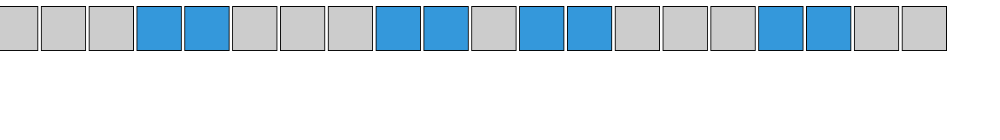
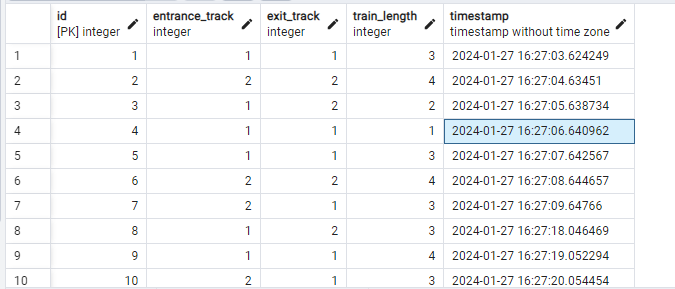

# Задание
Глобальное задание:
Реализовать кросплатформенный сервис отображения занятости участков станции в реальном времени.

Описание задач:
Реализовать клиент-серверное приложение (стек RabbitMQ/gRPC). Клиент (желательно Angular) получает от сервера ( c++, c#, Python3) в реальном времени занятость участков согласно технологической цепочке:
Поезда заходят раз в 2 тика (1 тик - 1 сек) на станцию с двумя входными путями (входной парк) и двумя выходными путями (выходной парк, см. рисунок). Длина поездов рандомна - от 1 до 4х участков, выбор пути входа - тоже рандомный. За 1 тик поезд проходит 1 участок. При этом он не становится на участок, если тот уже занят другим поездом. По проходу последнего участка поезд выходит со станции

Доп задачи*:
Сделать то же самое для станции с входным парком из 6го входных путей и 1го выходного пути. Добавить рандомность перехода поезда на след участок (поезд либо заходит на следующий участок, либо стоит на месте)
Добавить протоколирование (запись в PostrgeSQL и воспроизведение по заданному времени)
# При разработке использовались:

- Язык `Python`
- Брокер сообщений `RabbitMQ`
- База данных `PostrgeSQL`

# Установка:

Скачиваем установщик [**Erlang**](https://www.erlang.org/downloads)и [**RabbitMQ**](https://rabbitmq-website.pages.dev/docs/install-windows)

Устанавливаем библиотеку `pika`

```bash
pip install pika
```
Устанавливаем библиотеку `pika`

```bash
pip install flask
```
Устанавливаем библиотеку `pika`

```bash
pip install json
```
Устанавливаем библиотеку `psycopg2`

```bash
pip install psycopg2-binary
```
# Запуск:

В командной строке прописываем
```bash
rabbitmq-plugins.bat enable rabbitmq_management
```

Запускаем `server_data.py`
```shell
python server_data.py`
```
Запускаем `data.py``

```shell
python data.py`
```

# Результаты:

 
 
